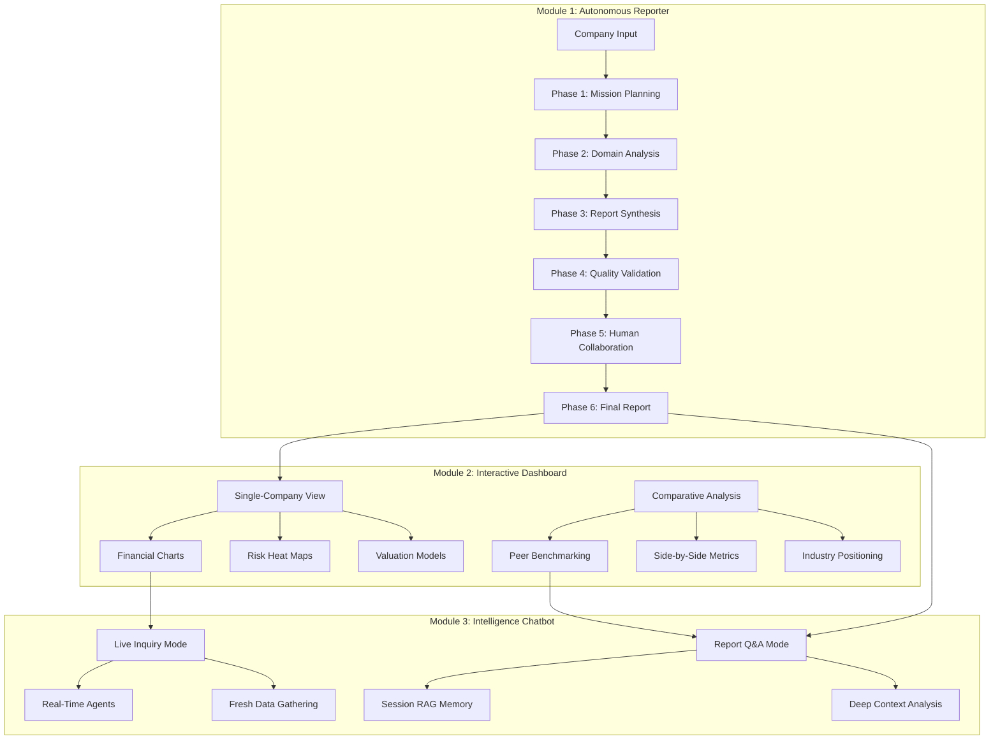

# Design Document

## Overview

The Heimdall V1 Master Workflow implements a sophisticated three-module financial intelligence platform that transforms your existing codebase into a comprehensive, enterprise-grade solution. This modular design showcases advanced software architecture skills while delivering practical business value.

**Three-Module Architecture:**

**Module 1: The Autonomous Reporter** - Core analytical engine with six-phase workflow for comprehensive report generation
**Module 2: The Interactive Intelligence Dashboard** - Professional visualization system with single-company and comparative analysis capabilities  
**Module 3: The Intelligence Chatbot** - Dual-mode conversational interface for report Q&A and live financial inquiries

**Key Technical Strengths:**
- **Modular Enterprise Architecture**: Clean separation of concerns with well-defined module interfaces
- **Advanced Multi-Agent Orchestration**: Sophisticated LangGraph workflows with autonomous decision-making
- **Interactive Data Visualization**: Professional dashboards with real-time comparative analysis
- **Conversational AI Integration**: Context-aware chatbot with multiple operational modes
- **Quality Assurance Systems**: Self-correcting validation loops and human-AI collaboration
- **Production-Ready Engineering**: Comprehensive error handling, monitoring, and scalability

## Architecture

### System Architecture

The platform consists of three interconnected modules that work together to provide comprehensive financial intelligence:



### Core Components

#### 1. Enhanced Workflow Controller

**Master Workflow State:**
```python
class MasterWorkflowState(HeimdallState):
    # Phase tracking
    current_phase: int = Field(default=1, description="Current workflow phase (1-5)")
    
    # Phase outputs
    mission_plan: Optional[str] = None
    domain_analyses: Dict[str, Any] = Field(default_factory=dict)
    draft_report: Optional[str] = None
    validation_feedback: Optional[str] = None
    human_feedback: Optional[str] = None
    
    # Quality metrics
    confidence_score: float = Field(default=0.0, description="Overall confidence in analysis")
    validation_passed: bool = Field(default=False)
```

**Workflow Orchestration:**
- **Sequential Phase Execution**: Clear progression through the five phases
- **State Management**: Proper state persistence using existing SQLite checkpointing
- **Error Handling**: Graceful error recovery with informative logging
- **Progress Tracking**: Clear visibility into workflow progress

#### 2. Phase Controllers

**Phase 1 - Mission Planning:**
```python
def mission_planning_node(state: MasterWorkflowState) -> Dict[str, Any]:
    # Use existing orchestrator logic
    # Generate mission plan based on company input
    # Trigger librarian_node for RAG ingestion
    # Return updated state with mission_plan
```

**Phase 2 - Domain Analysis:**
```python
def domain_analysis_node(state: MasterWorkflowState) -> Dict[str, Any]:
    # Use existing supervisors from main_supervisor.py
    # Execute research, valuation, risk, business, economic analysis
    # Aggregate results into domain_analyses
    # Return comprehensive analysis results
```

**Phase 3 - Report Synthesis:**
```python
def report_synthesis_node(state: MasterWorkflowState) -> Dict[str, Any]:
    # Create specialized writer agents
    # Generate individual report sections
    # Assemble into cohesive draft_report
    # Return structured draft for validation
```

#### 3. Quality Assurance System

**Phase 4 - Adversarial Validation:**
```python
def adversarial_validation_node(state: MasterWorkflowState) -> Dict[str, Any]:
    # Use existing compliance_agent for regulatory check
    # Implement socratic questioning using SocraticQuestions schema
    # Validate facts and consistency
    # Make refinement decision
    # Return validation results and feedback
```

**Phase 5 - Human Integration:**
```python
def human_collaboration_node(state: MasterWorkflowState) -> Dict[str, Any]:
    # Present report for human review (or auto-approve if no human available)
    # Process human feedback if provided
    # Generate final formatted report
    # Return completed analysis
```

## Components and Interfaces

### 1. Workflow Nodes

The implementation will create new workflow nodes that build on your existing components:

**New Workflow Structure:**
```python
# Enhanced workflow.py
workflow = StateGraph(MasterWorkflowState)

# Phase nodes
workflow.add_node("mission_planning", mission_planning_node)
workflow.add_node("domain_analysis", domain_analysis_node) 
workflow.add_node("report_synthesis", report_synthesis_node)
workflow.add_node("adversarial_validation", adversarial_validation_node)
workflow.add_node("human_collaboration", human_collaboration_node)

# Sequential flow with conditional logic
workflow.set_entry_point("mission_planning")
workflow.add_edge("mission_planning", "domain_analysis")
workflow.add_edge("domain_analysis", "report_synthesis")
workflow.add_edge("report_synthesis", "adversarial_validation")

# Conditional refinement loop
workflow.add_conditional_edges(
    "adversarial_validation",
    lambda state: "report_synthesis" if state.get("needs_refinement") else "human_collaboration"
)
workflow.add_edge("human_collaboration", END)
```

### 2. Report Writers

**Specialized Section Writers:**
```python
class FundamentalAnalysisWriter:
    def write_section(self, research_data: Dict, business_data: Dict) -> str:
        # Generate fundamental analysis section
        # Use existing financial analysis tools
        # Return formatted section content

class ValuationWriter:
    def write_section(self, valuation_data: Dict) -> str:
        # Generate valuation analysis section
        # Use existing DCF and comparable analysis tools
        # Return formatted valuation content

class RiskAnalysisWriter:
    def write_section(self, risk_data: Dict) -> str:
        # Generate risk analysis using FullRiskReport schema
        # Include financial, news, and technical risks
        # Return comprehensive risk assessment
```

### 3. Module 1: Autonomous Reporter Architecture

**Core Workflow Engine:**
```python
class AutonomousReporter:
    def __init__(self):
        self.workflow_orchestrator = WorkflowOrchestrator()
        self.mission_planner = MissionPlanner()
        self.domain_supervisors = DomainSupervisorTeam()
        self.editorial_team = EditorialTeam()
        self.adversarial_gauntlet = AdversarialGauntlet()
        self.human_collaboration = HumanCollaborationSystem()
    
    def generate_report(self, company_ticker: str) -> ComprehensiveReport:
        # Execute six-phase workflow
        # Return complete, vetted financial intelligence report
        
    def track_progress(self) -> WorkflowStatus:
        # Real-time progress monitoring
        # Agent execution transparency
```

### 4. Module 2: Interactive Intelligence Dashboard

**Visualization System Architecture:**
```python
class InteractiveDashboard:
    def __init__(self):
        self.single_company_view = SingleCompanyDashboard()
        self.comparative_analysis = ComparativeAnalysisDashboard()
        self.chart_generator = FinancialChartGenerator()
        self.data_processor = FinancialDataProcessor()
    
    def render_single_company_dashboard(self, report: ComprehensiveReport):
        # Interactive financial charts and metrics
        # Risk heat maps and compliance indicators
        # Valuation model visualizations
        
    def render_comparative_dashboard(self, companies: List[str]):
        # Side-by-side metric comparisons
        # Peer benchmarking analysis
        # Industry positioning charts
        
class FinancialChartGenerator:
    def create_trend_analysis(self, financial_data: Dict) -> Chart:
        # Revenue, profit, cash flow trend charts
        
    def create_ratio_analysis(self, ratios: Dict) -> Chart:
        # P/E, ROE, debt ratio visualizations
        
    def create_peer_comparison(self, peer_data: List[Dict]) -> Chart:
        # Comparative benchmarking charts
```

### 5. Module 3: Intelligence Chatbot System

**Dual-Mode Conversational Interface:**
```python
class IntelligenceChatbot:
    def __init__(self):
        self.report_qa_mode = ReportQAMode()
        self.live_inquiry_mode = LiveInquiryMode()
        self.conversation_manager = ConversationManager()
        self.query_classifier = QueryClassifier()
    
    def process_query(self, query: str, context: Optional[Dict] = None):
        # Classify query type and route to appropriate mode
        # Maintain conversation context and memory
        
class ReportQAMode:
    def __init__(self):
        self.session_rag = SessionRAGMemory()
        self.report_analyzer = ReportAnalyzer()
    
    def answer_report_question(self, question: str, report_id: str):
        # Deep, context-aware report discussions
        # Methodology explanations and alternative perspectives
        
class LiveInquiryMode:
    def __init__(self):
        self.real_time_agents = RealTimeAgentTeam()
        self.data_fetcher = LiveDataFetcher()
    
    def handle_live_inquiry(self, question: str, company: Optional[str] = None):
        # Quick ad-hoc financial questions
        # Fresh data gathering and analysis
```

### 6. Basic Prediction Engine

**Forward-Looking Analysis System:**
```python
class BasicPredictionEngine:
    def __init__(self):
        self.revenue_predictor = RevenueGrowthPredictor()
        self.stock_movement_analyzer = StockMovementAnalyzer()
        self.ratio_projector = FinancialRatioProjector()
        self.risk_scorer = RiskScorePredictor()
        self.model_explainer = ModelExplainer()
    
    def generate_predictions(self, company_data: Dict) -> PredictionReport:
        # Create comprehensive forward-looking analysis
        # Include confidence intervals and explanations
        
class RevenueGrowthPredictor:
    def __init__(self):
        self.linear_model = LinearRegression()
        self.trend_analyzer = TrendAnalyzer()
    
    def predict_revenue_growth(self, historical_data: List[float]) -> PredictionResult:
        # Simple linear regression with trend analysis
        # Include seasonal adjustments and confidence bands
        
class StockMovementAnalyzer:
    def __init__(self):
        self.technical_analyzer = TechnicalAnalyzer()
        self.pattern_recognizer = PatternRecognizer()
    
    def analyze_price_trends(self, price_data: List[float]) -> MovementPrediction:
        # Technical analysis patterns and momentum indicators
        # Support/resistance levels and trend predictions
        
class ModelExplainer:
    def explain_prediction(self, model_result: Any, feature_data: Dict) -> Explanation:
        # Feature importance analysis
        # Model methodology explanation
        # Confidence and limitation disclaimers
```

**Prediction Integration:**
```python
class PredictionReport(BaseModel):
    revenue_forecast: RevenuePrediction = Field(description="Revenue growth predictions")
    stock_outlook: StockPrediction = Field(description="Stock price movement analysis")
    ratio_projections: RatioProjections = Field(description="Financial ratio forecasts")
    risk_assessment: RiskPrediction = Field(description="Future risk score predictions")
    scenario_analysis: ScenarioAnalysis = Field(description="Optimistic/realistic/pessimistic cases")
    model_explanations: List[ModelExplanation] = Field(description="AI model transparency")
    confidence_metrics: Dict[str, float] = Field(description="Prediction confidence scores")
    disclaimers: List[str] = Field(description="Prediction limitations and risks")

class RevenuePrediction(BaseModel):
    next_quarter_growth: float = Field(description="Predicted quarterly revenue growth %")
    annual_growth_rate: float = Field(description="Predicted annual growth rate")
    confidence_interval: Tuple[float, float] = Field(description="95% confidence range")
    key_factors: List[str] = Field(description="Primary factors driving prediction")
    methodology: str = Field(description="Model methodology explanation")
```

**Key System Components:**
- **Module Integration Layer**: Seamless communication between all three modules
- **Unified Data Layer**: Shared access to RAG systems and financial databases
- **Prediction Pipeline**: Integrated forecasting across all analysis modules
- **Real-Time Synchronization**: Live updates across dashboard and chatbot interfaces
- **Quality Assurance**: Consistent validation and error handling across modules

### 4. Feedback & Performance System

**Feedback Collection Framework:**
```python
class FeedbackCollector:
    def collect_section_feedback(self, section_name: str, report_content: str):
        # Section-specific quality ratings (1-5 scale)
        # Accuracy assessment
        # Compliance adherence rating
        # Specific improvement suggestions
        
    def calculate_kpis(self, feedback_data: List[FeedbackRecord]):
        # Accuracy Rate calculation
        # Compliance Success percentage
        # Analyst Time Saved metrics
        # User Satisfaction scoring
        
class KPIDashboard:
    def render_performance_metrics(self):
        # Real-time KPI display
        # Trend analysis charts
        # Benchmarking against baselines
        # Performance alerts and notifications
```

### 5. Integration with Existing Components

**Leveraging Current Assets:**
- **Supervisors**: Use existing supervisors from `main_supervisor.py` (research, valuation, risk, business, economic)
- **Schemas**: Utilize existing schemas from `schemas.py` (FullRiskReport, SocraticQuestions, Evidence, etc.)
- **Tools**: Integrate existing financial analysis tools (DCF, technical analysis, compliance)
- **RAG System**: Build on existing `liberarian_node` and RAG infrastructure
- **Data Providers**: Use existing API integrations (Alpha Vantage, Polygon, Finnhub, etc.)

## Data Models

### Master Workflow State

```python
class MasterWorkflowState(HeimdallState):
    # Phase tracking
    current_phase: int = Field(default=1, description="Current workflow phase (1-5)")
    
    # Phase outputs
    mission_plan: Optional[str] = None
    domain_analyses: Dict[str, Any] = Field(default_factory=dict)
    draft_report: Optional[str] = None
    validation_feedback: Optional[str] = None
    human_feedback: Optional[str] = None
    
    # Quality metrics
    confidence_score: float = Field(default=0.0, description="Overall confidence in analysis")
    validation_passed: bool = Field(default=False)
    needs_refinement: bool = Field(default=False)
    
    # Report sections
    fundamental_analysis: Optional[str] = None
    valuation_analysis: Optional[str] = None
    risk_analysis: Optional[str] = None
    business_outlook: Optional[str] = None
```

### Report Structure

```python
class MasterReport(BaseModel):
    executive_summary: str = Field(description="High-level summary of key findings")
    fundamental_analysis: str = Field(description="Business and financial fundamentals")
    valuation_analysis: str = Field(description="Comprehensive valuation assessment")
    risk_analysis: str = Field(description="Risk assessment using FullRiskReport schema")
    business_outlook: str = Field(description="Future prospects and strategic outlook")
    investment_recommendation: str = Field(description="Final investment recommendation")
    confidence_metrics: Dict[str, float] = Field(description="Confidence scores by section")
    sources_cited: List[str] = Field(description="Data sources and references")

class FeedbackRecord(BaseModel):
    mission_id: str = Field(description="Unique mission identifier")
    analyst_id: str = Field(description="Reviewing analyst identifier")
    timestamp: datetime = Field(default_factory=datetime.now)
    
    # Section-specific ratings (1-5 scale)
    executive_summary_rating: int = Field(ge=1, le=5)
    fundamental_analysis_rating: int = Field(ge=1, le=5)
    valuation_analysis_rating: int = Field(ge=1, le=5)
    risk_analysis_rating: int = Field(ge=1, le=5)
    business_outlook_rating: int = Field(ge=1, le=5)
    
    # Overall metrics
    overall_accuracy: int = Field(ge=1, le=5, description="Overall report accuracy")
    compliance_adherence: int = Field(ge=1, le=5, description="Regulatory compliance quality")
    time_saved_hours: float = Field(description="Estimated hours saved vs manual analysis")
    analyst_satisfaction: int = Field(ge=1, le=5, description="Overall satisfaction score")
    
    # Qualitative feedback
    strengths: List[str] = Field(description="Report strengths and highlights")
    improvements: List[str] = Field(description="Areas for improvement")
    comments: Optional[str] = Field(description="Additional analyst comments")

class ChatbotInteraction(BaseModel):
    interaction_id: str = Field(description="Unique interaction identifier")
    user_id: str = Field(description="User identifier")
    timestamp: datetime = Field(default_factory=datetime.now)
    question: str = Field(description="User's question")
    response: str = Field(description="Chatbot's response")
    query_type: Literal["general_finance", "report_specific", "calculation", "educational"] = Field(description="Type of query")
    confidence_score: float = Field(ge=0.0, le=1.0, description="Confidence in response accuracy")
    sources_cited: List[str] = Field(description="Sources used in response")
    user_satisfaction: Optional[int] = Field(ge=1, le=5, description="User rating of response quality")
    follow_up_questions: List[str] = Field(default_factory=list, description="Suggested follow-up questions")

class FinanceKnowledgeBase(BaseModel):
    concepts: Dict[str, str] = Field(description="Financial concepts and definitions")
    formulas: Dict[str, str] = Field(description="Financial formulas and calculations")
    regulations: Dict[str, str] = Field(description="Regulatory requirements and standards")
    market_data: Dict[str, Any] = Field(description="Current market information")
    educational_content: Dict[str, str] = Field(description="Learning materials and tutorials")

class KPIMetrics(BaseModel):
    accuracy_rate: float = Field(description="Percentage of reports with 4+ accuracy rating")
    compliance_success_rate: float = Field(description="Percentage with 4+ compliance rating")
    avg_time_saved: float = Field(description="Average hours saved per report")
    user_satisfaction: float = Field(description="Average satisfaction score")
    system_reliability: float = Field(description="Successful completion rate")
    total_missions: int = Field(description="Total missions completed")
    chatbot_interactions: int = Field(description="Total chatbot interactions")
    chatbot_satisfaction: float = Field(description="Average chatbot response rating")
    period_start: datetime = Field(description="Metrics period start")
    period_end: datetime = Field(description="Metrics period end")
```

## Error Handling

### Simple but Effective Error Management

**Phase-Level Error Handling:**
```python
def safe_execute_phase(phase_func, state, phase_name):
    try:
        logger.info(f"Starting {phase_name}")
        result = phase_func(state)
        logger.info(f"Completed {phase_name}")
        return result
    except Exception as e:
        logger.error(f"Error in {phase_name}: {e}")
        # Return partial results or fallback response
        return {"error": f"{phase_name} failed: {str(e)}", "partial_results": True}
```

**Graceful Degradation:**
1. **Continue with Partial Results**: If one supervisor fails, continue with others
2. **Fallback Responses**: Provide meaningful error messages and partial analysis
3. **Retry Logic**: Simple retry for transient failures (API timeouts, etc.)
4. **Logging**: Comprehensive logging for debugging and monitoring

## Testing Strategy

### Focused Testing Approach

**Unit Testing:**
- Test individual phase nodes with mock data
- Validate report writer functionality
- Test schema compliance and data validation
- Verify existing component integration

**Integration Testing:**
- End-to-end workflow testing with sample companies
- Test the five-phase progression
- Validate state management and persistence
- Test error handling and recovery

**Manual Testing:**
- Run complete analysis on well-known companies (Apple, Microsoft, etc.)
- Verify report quality and accuracy
- Test human feedback integration
- Validate compliance checking

This simplified but solid design focuses on creating a working, impressive system that showcases your skills without unnecessary complexity. The five-phase workflow will demonstrate sophisticated system design while building on your existing strong foundation.